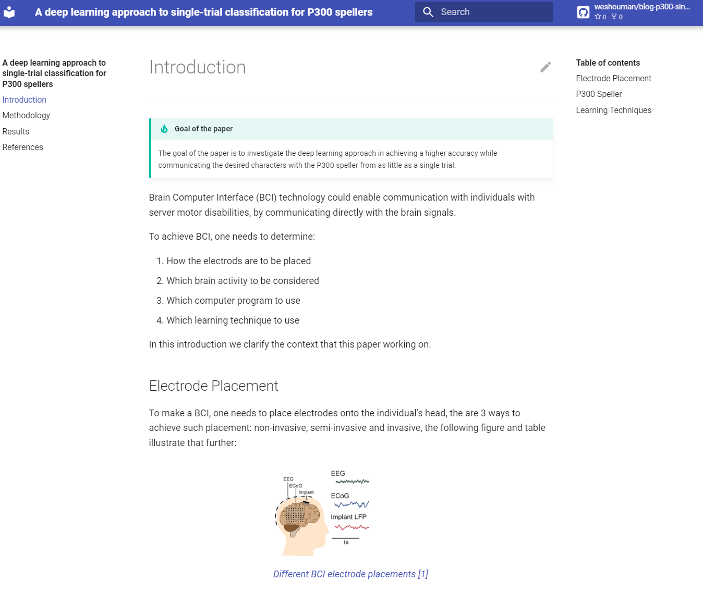

# Blog P300 Single Trial Classification

[This documentation/blog post](https://weshouman.github.io/blog-p300-single-trial-classification/) discusses the paper [`Nader N. Nashed, Seif Eldawlatly and Gamal M Aly, "A deep learning approach to single-trial classification for P300 spellers", IEEE Middle East Conference on Biomedical Engineering, vol. 2018, no. 1, pp. 11-16, July 2018.`](https://ieeexplore.ieee.org/document/8402397)

