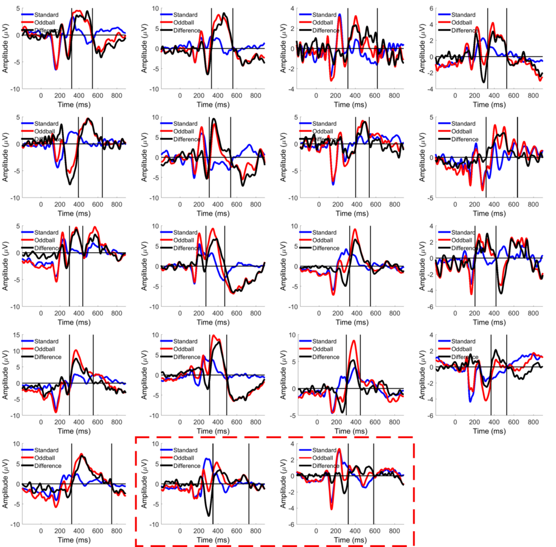
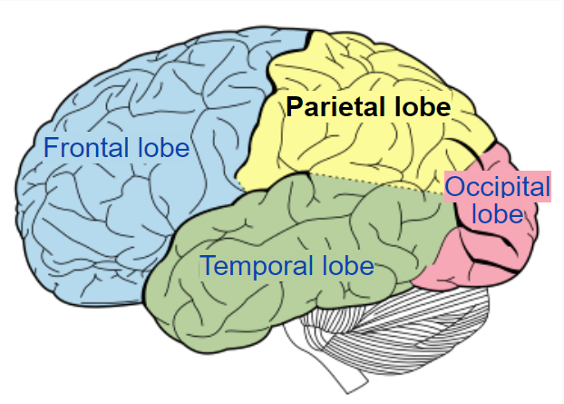
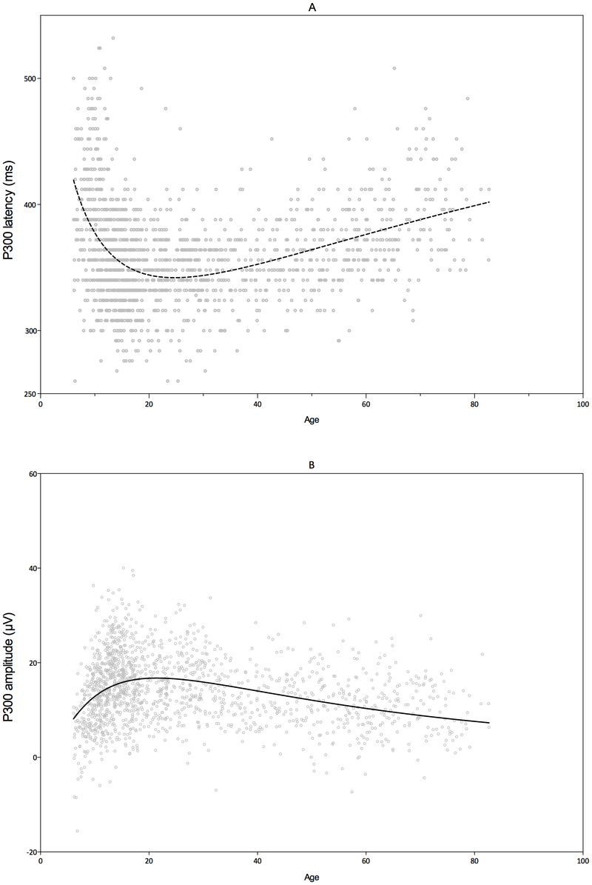
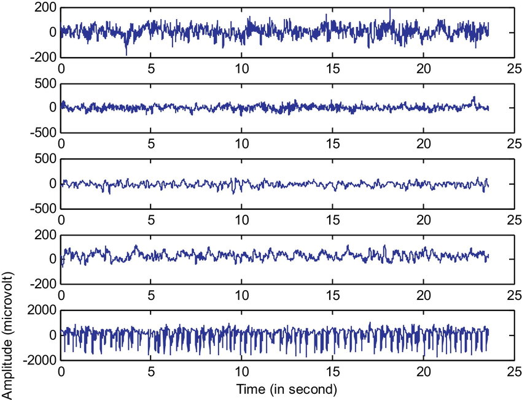

# Introduction

---

!!! Important "Goal of the paper"
    The goal of the paper is to investigate the deep learning approach in achieving a higher accuracy while communicating the desired characters with the P300 speller from as little as a single trial.

<figure markdown>
  {width="400"}
  <figcaption><a href="https://nypost.com/2018/10/22/scientists-use-human-neurons-to-grow-3d-brain-tissue/">A Human Brain [15]</a></figcaption>
</figure>

Brain Computer Interface (BCI) is the interface made between a human's brain and a computer so that it's possible to get data directly from the brain into the computer or even further, the vice versa.

Such technology could enable communication with individuals with severe motor disabilities, by communicating directly with the brain signals, for example, if a subject is want to control a robotic arm or even connected to a prosthetic arm, a signal could be taken directly from the brain to control this arm, or even if the subject is not able to talk, we could figure out what he want to say by directly communicating with the brain.  

This actually happens due to the fact that the brain functions by the communication between different neurons, those neurons send to each other messages in the form of voltage spikes, either high or low.

<figure markdown>
  {width="300"}
  <figcaption><a href="https://www.zuniv.net/physiology/book/">Neuron Structure [16]</a></figcaption>
</figure>

Theoritcally, if we have access to each neuron's output we can record and regenerate the whole interactions needed for the brain to think about/plan and take an action. However, this task is not that simple taking into consideration a human brain has around `10^11` neurons, *requiring `10^11` sensors*.

Thus, the 2 solutions we are left with are:  

1. Using the current knowledge we have about the human brain to narrow down to specific neurons to measure.
2. Lowering the spatial resolution by using sensors.  

In general, this is not the only decision that needs to be taken to achieve the Brain Computer Interface, there are more information that we need to gather, and that could be managed by answering the following 4 questions:

1. How to place the electrodes
2. Which brain activity to consider
3. Which computer program to use
4. Which learning technique to use

Next, we clarify the context that this paper is working on by answering those 4 questions.

---

## How To Place The Electrodes

In the BCI field the sensors are called electrodes, and they read the voltage of a specific area, the smaller the number of neurons within this area the higher the spatial resolution of such method.

Those electrodes are placed onto the individual's head.
However, the more we need to increase the spatial resolution the further into the brain we need to place the electrodes, which implies we wouldn't be only putting the electrode on the subject's head, but we'd also need to be invasive and inject the electrode in the subject's head to be as close as possible to a specific neuron and reach the maximum spatial resolution.

Luckily, with the current knowledge available about the brain, we can get meaningful information without a surgery, but of course with less spatial resolution. 

In summary, there are 3 ways to achieve such placement: non-invasive, semi-invasive and invasive, the following figure and table illustrate that further:

<figure markdown>
  {width="200"}
  <figcaption><a href="https://www.bmseed.com/stretchable-electrodes-for-brain-implants">Different BCI electrode placements [1]</a></figcaption>
</figure>

| Method      | Non-Invasive  | Semi-Invasive | Non-Invasive |
| ----------- | --------------|------------|------- |
| Recorded brain activity | Electroencephalographic (EEG) | Electrocorticography (ECoG) | Individual neurons |
| Electrode placement     | Over the head | Over the brain | Inside the brain |
| Surgical operation      | Not required | Required | Required |
| Spatial Resolution      | Least | Medium | High |

!!! Hint
    Sometimes both semi-invasive and invasive are called invasive, as in any case they both require a surgery.

!!! Note "Paper Approach"
    This paper investigates the usage of EEG based activities.

## Which brain activity to consider

There are many signals/activities that we could measure from the brain and consider for the BCI, Alpha, Beta, P300 ... etc.

<figure markdown>
  {width="300"}
  <figcaption><a href="https://en.wikipedia.org/wiki/P300_(neuroscience)#P3a_and_P3b">P300 activities on different subjects [18]</a></figcaption>
</figure>

This paper discusses the P300 brain activity which is elicited ~300 milliseconds after the presentation of an infrequent stimulus (for example, a visual stimulus or an auditory stimulus). This brain activity can be measured with electrodes placed on the parietal lobe of the brain. And it's usually used because of it's reproducibility and clarity in the BCI applications.

<figure markdown>
  {width="300"}
  <figcaption><a href="https://en.wikipedia.org/wiki/Parietal_lobe">Parietal lobe [19]</a></figcaption>
</figure>

It's also to be noted that, the p300 timing and voltage differs based on the subject age, the following figure shows how such difference occurs

<figure markdown>
  {width="300"}
  <figcaption><a href="https://en.wikipedia.org/wiki/P300_(neuroscience)#P3a_and_P3b">P300 activity over age [18]</a></figcaption>
</figure>

## Which computer program to use

Accordingly the program used for the interface is the P300 speller which works by showing the user a MxN matrix of the characters of interest (6x6 matrix for this paper) and flashing each row and column for K times (called K trials), for example if K is 1 (single trial) there will be 12 flashes (6 different row flashes and 6 different column flashes), K is 5 (5 trials) there will be 60 flashes (30 row flashes and 30 column flashes).  

<figure markdown>
  {width="400"}
  <figcaption><a href="https://www.researchgate.net/figure/Stimulus-and-operating-principle-of-P300-speller-When-the-subject-counts-the-number-of_fig2_311359887">Time diagram of a P300 speller [10]</a></figcaption>
</figure>

The flashes occur randomly and have Interintisification Intervals (ISI) of 100 ms between them.  

The user needs to focus on the character he wants to type each time, and once the screen flashes in front of him a brain activity shall evoke after 300 milliseconds which could be detected to figure out that the character the user is looking at is in the flashed row or column, 300 ms ago.  

Increasing the number of trials, would increase the detection accuracy, however each extra trial involves extra 12 flashes. 

!!! Note "Paper Approach"
    This paper utilizes the reads P300 brain activitiy, and uses the P300 speller as the software for interaction.  
    It also observes the effect of the deep learning approach on the decrease of the trials.

## Which Learning Technique To Use

<figure markdown>
  {width="300"}
  <figcaption><a href="https://www.researchgate.net/figure/Sample-EEG-dataset-Signals-shows-that-the-dataset-is-challenging-due-to-different_fig1_336228375">Sample EEG data [17]</a></figcaption>
</figure>

The data extracted from the brain is a voltage graph for each electrode, watching those graphs is like reading the 0's and 1's of different cores for a running operating system, what we can do though is to learn from those graphs, so that we could gather useful information from this high dimensionality data (considering each electrode a different dimension). Combining that with meaningful preprocessing filters we could reach great results.

To learn from the brain activities both feature extraction and classification shall be utilized. There are multiple techniques for doing so.
The classification problem in hand is considered a supervised learning one, as the classes are pre-known `{P300 and non-P300}`.

<figure markdown>
  {width="200"}
  <figcaption><a href="https://en.wikipedia.org/wiki/Artificial_neural_network">Artificial Neural Network [14]</a></figcaption>
</figure>

Different approaches could be considered to learn the model, for example Principal Component Analysis (PCA), Linear Discriminant Analysis (LDA), Independent Componant Analysis (ICA), autoencoders, Fisher's Linear Discriminant Classifier, Maximum Likelihood Discriminant Classifier KNN, etc.

!!! Note "Paper Approach"
    This paper addresses the deep learning technique for the model, namely using stacked autoencoders with softmax *a differentiable version of argmax*, to learn the data compared to the usage of Principal Component Analysis (PCA) and Linear Discriminant Analysis (LDA) in previous models.
