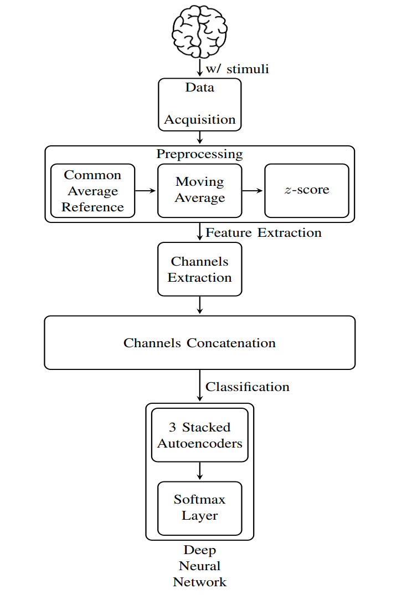
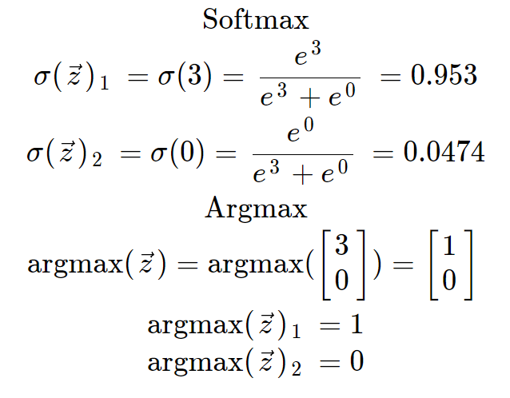

# Methodology

---

The methodology followed in the paper follows this Diagram

<figure markdown>
  {width="300"}
  <figcaption><a href="https://ieeexplore.ieee.org/document/8402397">Block Diagram [13]</a></figcaption>
</figure>

##  Data Acquisation

Data collected from an Emotiv Epoc which is installed based on the 10-20 international system. That is digitized and sampled at `240Hz`. and bandpass filtered in the range of `0.4Hz` to `45Hz`.  

<figure markdown>
  {width="200"}
  <figcaption><a href="https://en.wikipedia.org/wiki/10%E2%80%9320_system_(EEG)">International 10-20 system [5]</a></figcaption>
</figure>

The collected data consists of:

- Data from 2 healthy individuals.
- 36 character training data.
- 32 character test data.

Each epoch of the dataset included data from:

- 14 electrodes
- 12 intensifications of 100ms interval each (6 rows and 6 columns) repeated for 15 trials.

## Data Preprocessing

Following are the data preprocessing steps taken in order over the data

1. Common Average Reference (CAR) is executed first by removing the average of all the electrode from each electrode.
2. Moving Average Filter is run over a 25-sample window.
3. Z-Scores of each recorded data is computed to normalize the data using the mean and standard deviation.

## Feature Extraction

Features were extracted from only 4 electrodes (responsible for the visual processing `{O1, O2}` and cognitive processing `{P7, P8}`) for this paper's approach, and then compared to the 14 electrodes approach as found in the [Results section](results.md)  

### Previous Approach

The Principal Component Analysis (PCA) was used in reducing the dimensionality for the input data to extract the necessary features in an unsupervised manner.

### Paper Approach

3 layers of stacked sparse autoencoders are used. The autoencoder which allows non-linear transformation. over the linear transformation available through the PCA.

Multiple activation functions were investigated for this approach. 

#### Autoencoders

<figure markdown>
  {width="450"}
  <figcaption><a href="https://ieeexplore.ieee.org/document/8402397">Stacked autoencoders [13]</a></figcaption>
</figure>

An autoencoder is a non-linear classifier which is powerful in capturing the minimum number of features required to classify the data. It has the following properties:

- Consists of hidden units
- Learns the hidden unit parameters by trying to reconstruct the input into the output neurons.
- Requires correct choice of number of features.
- Non-linear, which could make it easily overfitting in comparison with other linear techniques like the PCA. Which requires good selection of the input data and features.

<figure markdown>
  {width="300"}
  <figcaption><a href="https://www.youtube.com/watch?v=xwrzh4e8DLs">PCA vs autoencoder [3]</a></figcaption>
</figure>

## Classification

The problem in hand involves a supervised classification of the targets {P300, non P300}.  

### Previous Approach

The supervised Linear Discriminant Analysis (LDA) was used in the previous approach.  
This is a classifier that uses the data labels to classify by projecting the data on the directions of:

- Maximum variance between classes.
- Minimum variance within classes.

### Paper Approach

The softmax regresion classifier is used for this approach. Which has the following properties:

- A generic version of logistic regression
- Number of outputs same as number of inputs
- Sum of the output neuron values is 1
- Differential which eases backprobagation
- *Unless similar output node values exist* One of the outputs would be close to 1, the others would be almost 0

<figure markdown>
  {width="300"}
  <figcaption><a href="https://deepai.org/machine-learning-glossary-and-terms/softmax-layer">Softmax computation example [8]</a></figcaption>
</figure>

<!-- $$ f_{i}(\vec{z})_{i}=\displaystyle \frac{e^{z_{i}}}{\sum_{j=1}^{K}e^{z_{j}}} $$ -->