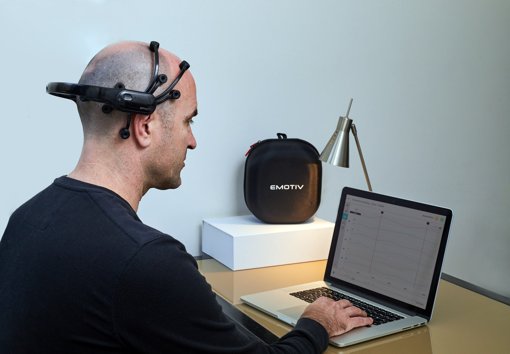
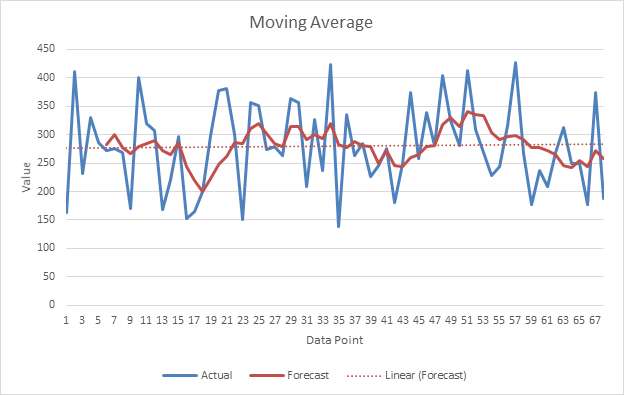
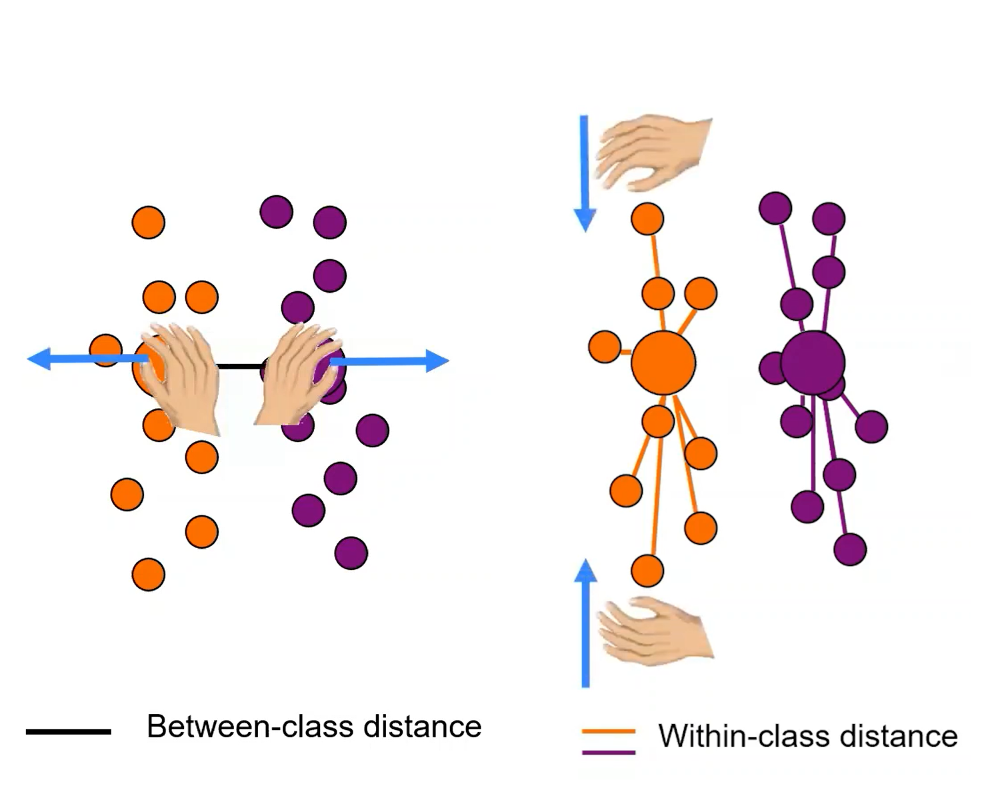

# Methodology

---

The main phases followed in the paper are as following:  

- Data Acquisition: collecting the data from the subject brain.
- Data Preprocessing: Preparing the data for processing by use of various filters.
- Feature Extraction: Getting specific features of the data to learn from.
- Classification: Learning whether the signal represent a P300 or not.

Such phases are summarized in the following Diagram

<figure markdown>
  {width="300"}
  <figcaption><a href="https://ieeexplore.ieee.org/document/8402397">Methodology Block Diagram [13]</a></figcaption>
</figure>

For the feature extraction and the classification, the paper considers a different approach from a previous one that appeared in the paper [A Principal Component Analysis Ensemble Classifier for P300 Speller Applications](https://ieeexplore.ieee.org/document/6703782), which would be further clarified while discussing the used feature extraction and classification methods.

##  Data Acquisition

<figure markdown>
  {width="200"}
  <figcaption><a href="https://www.emotiv.com/epoc/">Emotiv EPOC headset [20]</a></figcaption>
</figure>

There are various headsets that could be used to capture the brain data, the EEG data for this paper is collected from an Emotiv EPOC which is installed based on the 10-20 international system, a system standardizing the names of different locations on the brain for electrode placement. The data is digitized and sampled at `240Hz`. and bandpass filtered in the range of `0.4Hz` to `45Hz`, which means that only the data in this frequency range is considered.  

<figure markdown>
  {width="200"}
  <figcaption><a href="https://en.wikipedia.org/wiki/10%E2%80%9320_system_(EEG)">International 10-20 system [5]</a></figcaption>
</figure>

The collected data is taken from 2 healthy individuals, for each there was 36 captured characters as training data and 32 captured characters as test data.

Each epoch (character) of the dataset included data from:

- 14 electrodes
- 12 intensifications of 100ms interval each (6 rows and 6 columns) repeated for 15 trials.

## Data Preprocessing

Following are the data preprocessing filters applied, in order, over the data

### Common Average Reference

The EEG reads data in range of microvolts, this voltage difference is taken against a ground electrode, which is connected to the headset's ground, and could pick up noise that does not reach other electrodes, to avoid such differences in voltage an online reference (for example, the common average of all electrodes) is picked up to be subtracted from all the electrodes, thus any noise that affects the electrodes gets removed equally from all the electrodes.  

Subtracting the common average of all the electrodes from each electrode is called Common Average Referencing.

### Moving Average Filter

<figure markdown>
  {width="200"}
  <figcaption><a href="https://medium.com/blueeast/how-to-use-moving-average-filter-to-counter-noisy-data-signal-5b530294a12e">Moving average filter [22]</a></figcaption>
</figure>

A moving average filter is a simple low pass filter that smoothes the change of the data thus preventing been susceptable to outliers.  

The data in the paper goes through a moving average filter which is run over a 25-sample window.

### Z-Scores

Finally, the Z-Scores of each recorded data is computed to normalize the data using the mean and standard deviation. Which allows for statistically equal treatment of the data dimensions.

## Feature Extraction

After the data is preprocessed, we extract the features that we learn from

The features in this paper were extracted from 4 electrodes, which are, based on the `International 10-20 system` located at:

- `{O1, O2}`: responsible for the visual processing
- `{P7, P8}`: responsible for the cognitive processing

Later on, the outcome is compared to the learning from all of the 14 electrodes as found in the [Results section](results.md#number-of-channels-in-classification)  

### Previous Approach for Feature Extraction

In the [previous paper](https://ieeexplore.ieee.org/document/6703782) approach the Principal Component Analysis (PCA) was used in reducing the dimensionality for the input data to extract the necessary features in an unsupervised manner.

#### PCA

Principle Component Analysis classifies by capturing the axes that maximizes the variance of the given data and it's used to capture maximum number of independent set of axes over which we could represent the data.

<figure markdown>
  {width="300"}
  <figcaption><a href="https://en.wikipedia.org/wiki/Principal_component_analysis">PCA [23]</a></figcaption>
</figure>

### Paper Approach for Feature Extraction

In this paper autoencoders are used for feature extraction

#### Autoencoders

An autoencoder is a non-linear classifier which is powerful in capturing the minimum number of features required to classify the data. That occurs  by creating bottleneck nodes that store only the needed data to regenerate the same input data.  

Autoencoders could be stacked, and in this paper 3 layers of stacked sparse autoencoders are used, which are later compared in the [results.md](results.md#hidden-layer-size-of-stacked-autoencoders).

<figure markdown>
  {width="450"}
  <figcaption><a href="https://ieeexplore.ieee.org/document/8402397">Stacked autoencoders [13]</a></figcaption>
</figure>

Using autoencoder allows use of non-linear transformation. over the linear transformation available through the PCA. We could also find in the [results.md](results.md#activation-function), multiple activation functions were investigated for this approach. 

Following are some properties of an autoencoder:

- Consists of hidden units
- Learns the hidden unit parameters by trying to reconstruct the input into the output neurons.
- Requires correct choice of number of features.
- Non-linear, which could make it easily overfitting in comparison with other linear techniques like the PCA. Which requires good selection of the input data and features.

<figure markdown>
  {width="300"}
  <figcaption><a href="https://www.youtube.com/watch?v=xwrzh4e8DLs">PCA vs autoencoder [3]</a></figcaption>
</figure>

## Classification

The problem in hand involves a supervised classification of the targets {P300, non P300}.  

Similar to the previous section, we describe next the previous approach and the current paper's approach.

### Previous Approach

The supervised Linear Discriminant Analysis (LDA) was used in the previous approach.  

#### Linear Discriminant Analysis

Linear Discriminant Analysis is a classifier that uses the data labels to classify by projecting the data on the directions of:

- Maximum variance between classes.
- Minimum variance within classes.

<figure markdown>
  {width="300"}
  <figcaption><a href="https://www.youtube.com/watch?v=SP9r1L_C494">LDA class distances [2]</a></figcaption>
</figure>

LDA's concept is very similar to the PCA except for the fact that they take the class targets into calculation.

### Paper Approach

The used classifier for the paper's approach is a softmax regression classifier

#### Softmax Classifier

Represented by the formula  

$$ f_{i}(\vec{z})_{i}=\displaystyle \frac{e^{z_{i}}}{\sum_{j=1}^{K}e^{z_{j}}} $$

The softmax regresion classifier is used for this approach. Which has the following properties:

- A generic version of logistic regression
- Number of outputs same as number of inputs
- Sum of the output neuron values is 1
- Differential which eases backprobagation
- *Unless similar output node values exist* One of the outputs would be close to 1, the others would be almost 0

<figure markdown>
  {width="300"}
  <figcaption><a href="https://deepai.org/machine-learning-glossary-and-terms/softmax-layer">Softmax computation example [8]</a></figcaption>
</figure>
